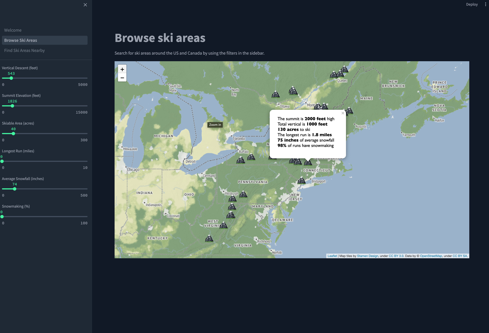
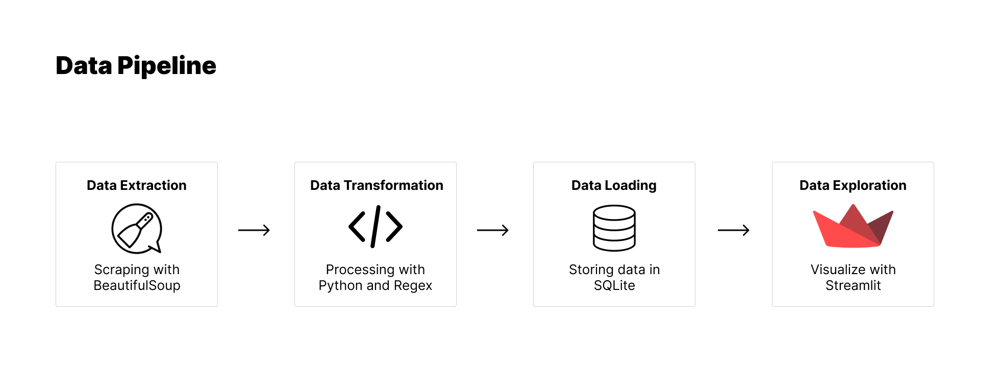

# Find the ideal ski area near you

The goal of this project is to help skiers find the best ski areas near them. You can view all the ski areas on a map of the US and Canada while filtering for specific mountain characteristics like vertical descent and average annual snowfall.

Here's a screenshot of the current dashboard:

## How this codebase works

1. The scripts in the `etl` folder are used to extract, transform and load the data. The data is scraped from SkiCentral.com, processed into the proper formats and stored in a local SQLite database.

2. The data is visualized via a Streamlit dashboard. [It is hosted here](https://github.com/ty-shaikh/ski-areas).

## Local run instructions

1. Check the requirements file to install the necessary packages to your local environment
2. Get a free API key from Bing Maps in order to look up latitude and longitude values and put into a `.env` in the root directory
3. Run the scripts in the `etl` folder from the root directory to build the initial database
  - `python etl/extract.py && python etl/load.py && python etl/transform.py`
4. Run the Streamlit code from the root directory
  - `streamlit run dashboard.py`
