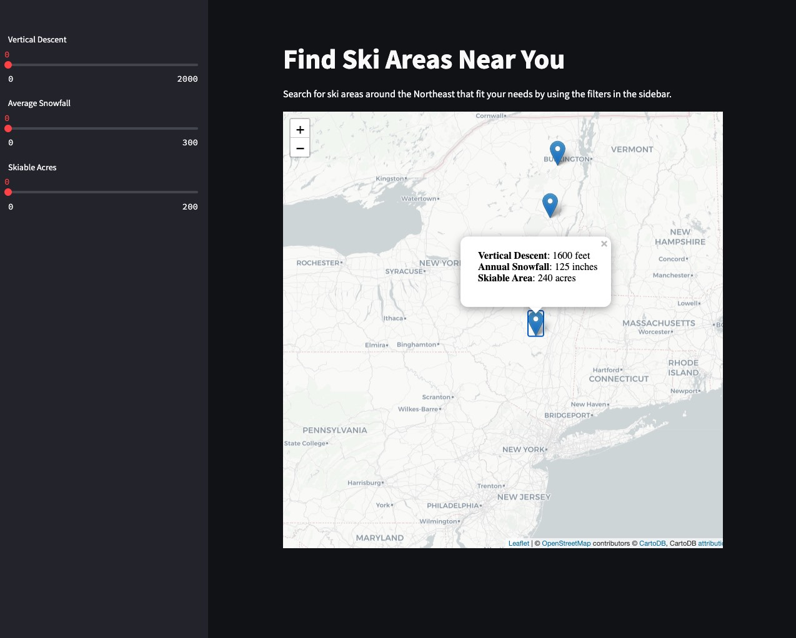

# Find the ideal ski area near you

The goal of this project is to help skiers find the best ski areas near them. During the season, skiers are most concerned with deciding whether to make a trip to a local mountain or a far mountain. This comes down to current snow conditions, how big the mountain is, how busy the mountain will be and how far it is.

For example, if there was a big snowstorm recently and it's a holiday weekend coming up, you will definitely want to make a long drive to one of the bigger mountains. If the weather has been so-so, you may not want to make the long drive and wait on long lift lines for mediocre conditions. You would opt for a smaller local mountain to get some runs in.

Here's a screenshot of the current dashboard:

## How this codebase works

1. The scripts in the `etl` folder are used to extract, transform and load the data. The data is scraped from SkiCentral.com, processed into the proper formats and stored in a local SQLite database.

2. The data is visualized via a Streamlit dashboard. [It is hosted here](https://ski-areas-ct5b86xaea2j6jbzaymqit.streamlit.app/).

## Local run instructions

1. Check the requirements file to install the necessary packages to your local environment
2. Get a free API key from Bing Maps in order to look up latitude and longitude values and put into a `.env` in the root directory
3. Run the scripts in the `etl` folder from the root directory to build the initial database
  - `python etl/extract.py && python etl/load.py && python etl/transform.py`
4. Run the Streamlit code from the root directory
  - `streamlit run dashboard.py`
